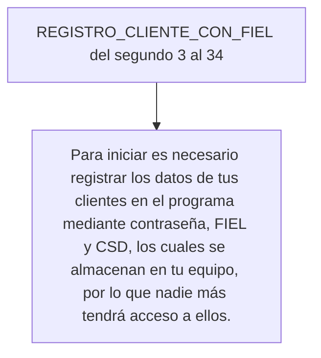

[Ir al indice](https://bitbucket.org/onefacture/requerimientos-videos-onefacture/src/master/README.md)
# Mini tour general Onefacture

Este documento define los requerimientos del vídeo mini tour general

## Indice

1. [Inicio](#inicio)
2. [Mis clientes](#modulo-mis-clientes)
3. [Mis clientes 2](#modulo-mis-clientes-2)
4. [Módulo descarga](#modulos-de-descarga)
5. [Módulo multi-descarga](#modulo-multi-descarga)
6. [Módulo almacen](#modulo-almacen)
7. [Módulo efos](#modulo-efos)

## Inicio <a name="inicio"></a>

Instrucciones:

`[No contamos con vídeo, lo dejamos a tu criterio]`

Speech:

> Onefacture CFDI (ce-efe-de-i) es un programa de descarga masiva de XMLs (equis-eme-eles) que funciona a través de procesos automatizados con el cual podrás tener más control sobre los datos de tus contri buyentes.

_________________

**Nota**: Ocultar los RFCs que se muestran en los vídeos.

## Módulo mis clientes <a name="modulo-mis-clientes"></a>

Instrucciones:

- Vídeo [REGISTRO_CLIENTE_CON_FIEL](https://onefacture-releases.nyc3.digitaloceanspaces.com/videos-onefacture/mod_clientes_registro_cliente_con_fiel.mov)
- Vídeo [REGISTRO_CLIENTE_CON_CAPTCHA](https://onefacture-releases.nyc3.digitaloceanspaces.com/videos-onefacture/mod_clientes_registro_cliente_con_contraseña_y_captcha.mov)

```
Poner el video REGISTRO_CLIENTE_CON_FIEL del segundo 3 al 34
Poner los vídeos de REGISTRO_CLIENTE_CON_FIEL y REGISTRO_CLIENTE_CON_CAPTCHA en paralelo
REGISTRO_CLIENTE_CON_FIEL del segundo 34 al minuto 1 con 15 segundos
REGISTRO_CLIENTE_CON_CAPTCHA del segundo 34 al minuto 1 con 4 segundos
```



Speech:

> Para iniciar es necesario registrar los datos de tus clientes en el programa mediante contraseña, FIEL (fiel) y CSD (ce-ese-de), los cuales se almacenan en tu equipo, por lo que nadie más tendrá acceso a ellos.
_________________

## Módulo mis clientes 2 <a name="modulo-mis-clientes-2"></a>

Instrucciones:

```
[Vídeo inicio_firmas_por_expirar.mov INICIO_FIRMAS]
INICIO_FIRMAS del segundo 0 al 10 (Acelerado en lo que dure el speech)
Te sugerimos hacer el registro de tus FIEL (fiel) y CSD (ce-ese-de), para que el programa te notifique la fecha próxima de expiración de las mismas.
[Vídeo mod_clientes_archivos_sat_desde_modulo_clientes_accesando_con_fiel.mov -> Archivos _SAT FIEL]
[Vídeo mod_clientes_archivos_sat_desde_modulo_clientes_accesando_con_contraseña_captcha.mov->Archivos _SAT CAPTCHA]
Archivos_SAT FIEL del segundo 0 al 1:30
Mientras el vídeo Archivos_SAT FIEL avanza, poner en paralelo el vídeo Archivos_SAT CAPTCHA del  segundo .05 al 0.35 (ambos videos pueden ser acelerados en lo que dure en speech)
```

Speech:

> Desde el módulo mis clientes puedes obtener la constancia de situación fiscal, opinión de cumplimiento SAT (sat) e IMSS (ims), para esta última si tu cliente es una persona moral, es necesario hacer el registro previo del representante legal para que puedas obtener dicha opinión.

> Si tu cliente se encuentra registrado con FIEL (fiel) el acceso será automático, si se encuentra registrado con contraseña es necesario digitar el captcha.
_________________

## Modulos de descarga <a name="modulo-de-descarga"></a>

Instrucciones:

```
[Vídeo mod_descarganormal_descarga_cfdi_emitidos_y_recibidos_con_fiel.mov -> Descarga FIEL]
[Vídeo mod_descarganormal_descarga_cfdi_emitidos_y_recibidos_con_contraseña_captcha.mov-> Descarga captcha]
[Vídeo mod_descarganormal_descarga_cfdi_emitidos_por_uuid->Descarga UUID]
Descarga FIEL poner el vídeo del segundo 0.02 al 1.20
Descarga UUID poner del minuto 0.15 al 1.29 (Los videos pueden ser acelerados en lo que dure en speech)
```

Speech:

> Contamos con los siguientes módulos de descarga:

> Descarga CFDI (ce-efe-de-i), puedes obtener de 2 mil a 8 mil XMLs (equis-eme-eles) o retenciones por petición, dependiendo de la velocidad del equipo, internet y SAT(sat). Así mismo puedes hacer la descarga por uno o varios UUID (u-u-i-de).
_________________

## Módulo multi-descarga <a name="modulo-multi-descarga"></a>

Instrucciones:

```
[Vídeo mod_multi-descarga_descarga_emitidos_y_recibidos -> MULTI_DESCARGA]
MULTI DESCARGA poner vídeo del segundo 0 al minuto 02:50 (Acelerado en lo que dure el speech)
Multidescarga, permite generar una cola de descarga automática para obtener los XMLs (equis-eme-eles) y retenciones de varios clientes con un solo clic.
[Vídeo mod_sat-ws_solicitud_de_paquetes.mov -> SAT WEB SERVICE
[Vídeo mod_sat-ws_sincronizacion_almacen.mov -> Sincronización Almacén
SAT WEB SERVICE poner vídeo del segundo 0 hasta el 0.42
Sincronización Almacén, poner del segundo .02 al 0.18
```

Speech:

> Descarga SAT(sat) Web Service, permite obtener hasta 200 mil XMLs (equis-eme-eles) por petición, si se requiere descargar más de dicho número se debe dividir la consulta en rangos de tiempo a modo de que sea menor a lo mencionado.
_________________

## Modulo almacén <a name="modulo-almacen"></a>

Instrucciones:

```
[Vídeo mod_almacen_exportar_todos_desde_consulta.mov -> Consulta Almacén
Consulta Almacén poner en vídeo del segundo 0 al 0.18
```

Speech:

> En el módulo de almacén podrás consultar tus XMLs (equis-eme-eles) descargados, validar el estatus y exportarlos a excel y PDF (pe-de-efe).
_________________

## Modulo EFOS <a name="modulo-efos"></a>

Instrucciones:

```
[Vídeo mod_efos_activacion_modulo.mov -> Activación módulo EFOS
Activación módulo EFOS poner en el vídeo del segundo 0 al 0.24
```

Speech:

> Por último, para recibir notificaciones de Empresas que Facturan Operaciones Simuladas, tendrás que ir al módulo de EFOS (efos)  y activar manualmente la funcionalidad. Misma que te informará cuando alguno de tus contribuyentes tenga operaciones con algún contribuyente en el listado 69-B, cabe mencionar que los proveedores se obtienen de las descargas de tus XMLs (equis-eme-eles) recibidos.

